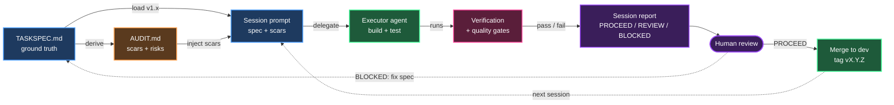

# FORGE Protocol

**Autonomous agent delegation for spec-driven software projects.**

*Shape it once. Strike until it holds.*

FORGE turns a single specification into a graph of autonomous build sessions. Agents derive, build, verify, and report. Humans review verdicts — not diffs, not gates, not branches.

It solves three failure modes of long-running AI-assisted builds:

| Problem | FORGE's answer |
|---|---|
| **Context decay** — agents forget the plan | Spec is re-loaded into every session prompt |
| **Compounding rot** — bugs cascade across sessions | Verification + quality gates block progression |
| **Regression blindness** — fixes break prior work | The full test suite runs as the regression anchor |

---

## Flow



All workflow artifacts live in `.forge/` (gitignored). Git history shows only feature commits — no session numbers, no protocol terms.

---

## Install

```bash
git clone git@github.com:phj6688/forge-protocol-skill.git
cd forge-protocol-skill
./install.sh
```

This symlinks `bin/forge` into `~/.local/bin/forge` and ensures the directory is on your `$PATH`.

Verify:

```bash
forge version
```

To use as an agent skill, copy `SKILL.md` and `references/` into your agent's skills directory under a `forge-protocol/` folder.

---

## Usage

```bash
forge init my-project      # scaffold .forge/
# edit .forge/TASKSPEC.md   — define mission, stack, Build Order
forge audit                # brownfield: verdicts + scars from existing code
forge risk                 # greenfield: projected risks + scar seeds
forge prompt 1             # generate session 1 prompt
# delegate the prompt to an executor agent — it builds, tests, reports
forge merge 1              # merge feature branch to dev, tag vX.Y.Z
forge prompt 2             # next session
forge status               # DAG progress
```

---

## Project layout

```
forge-protocol-skill/
├── SKILL.md                    agent skill definition (v3)
├── bin/forge                   CLI tool
├── install.sh                  symlinks bin/forge to ~/.local/bin
├── examples/
│   └── TASKSPEC-example.md     reference spec (NullDrift signal engine)
└── references/
    └── templates.md            TASKSPEC, AUDIT, session prompt templates
```

When you run `forge init`, the target project gets:

```
my-project/
└── .forge/                     (gitignored)
    ├── TASKSPEC.md             canonical spec, append-only
    ├── AUDIT.md                audit or risk report
    ├── state.json              DAG progress
    └── sessions/
        └── 01-data-layer/
            ├── prompt.md
            └── output.md
```

---

## Principles

1. **Spec-driven.** Everything derives from `TASKSPEC.md`. Agents derive, never guess.
2. **Autonomous execution.** Agents build, run gates, produce reports. Humans review results only.
3. **Invisible workflow.** Git history looks human-built. FORGE artifacts never reach the repo.
4. **Feature-oriented git.** Branches and tags describe *what* was built, not *which session* built it.
5. **Test suite as regression.** The test suite verifies prior work. No gate replay.

---

## License

MIT.
